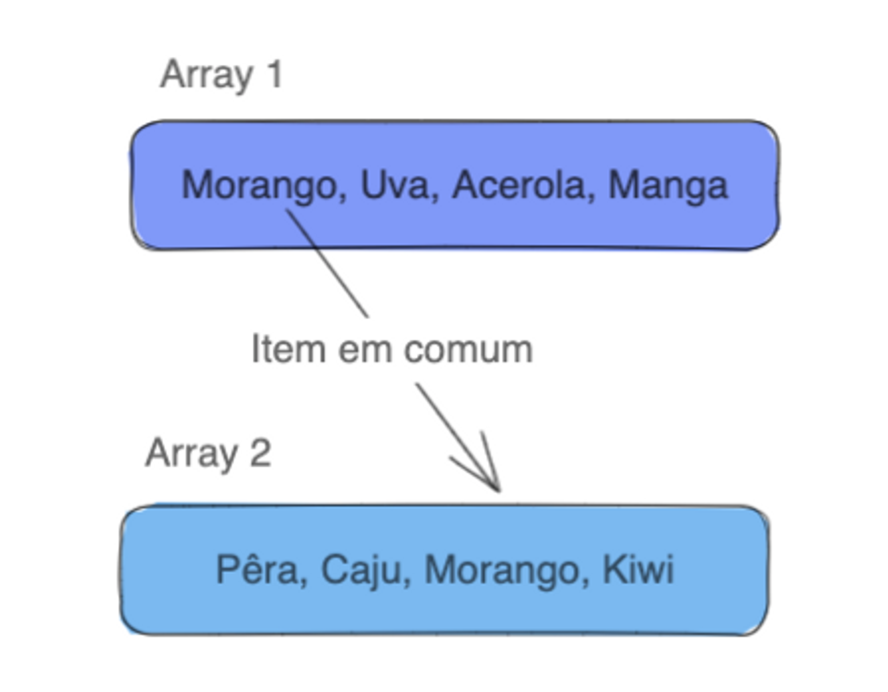

## Exercicio Duplicados Não

Objetivo deste exercício é introduzir alguns conteúdos básicos de Java

## Enunciado

Escreva um código que encontre os `elementos em comum que existem em dois arrays` e imprima os nomes dos itens em comum! Exemplo:

